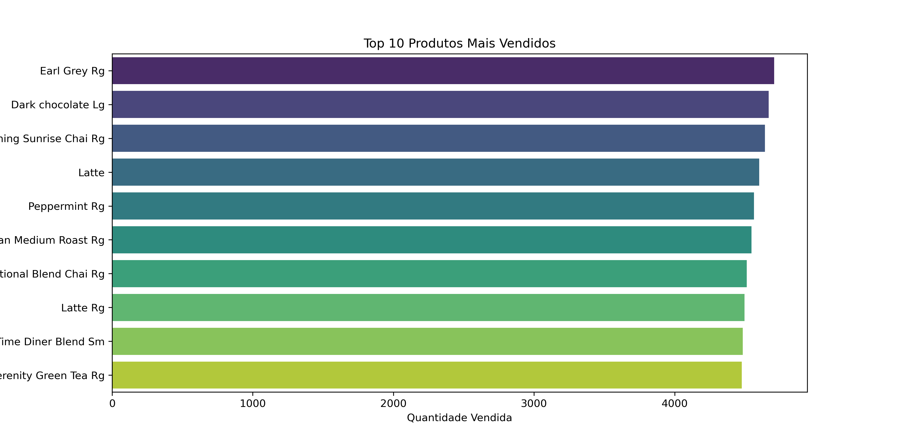
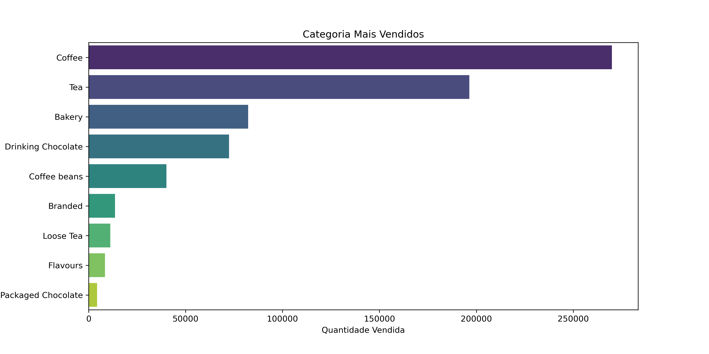
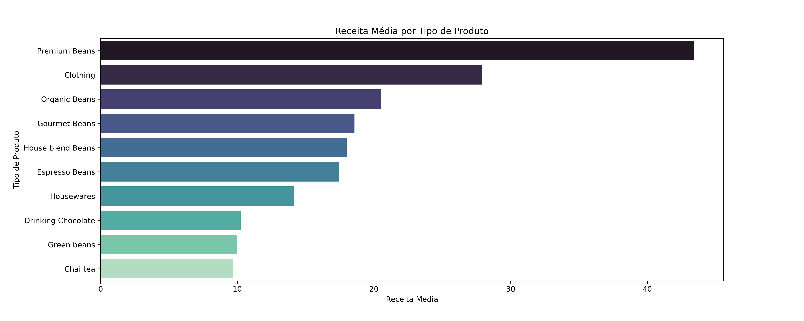
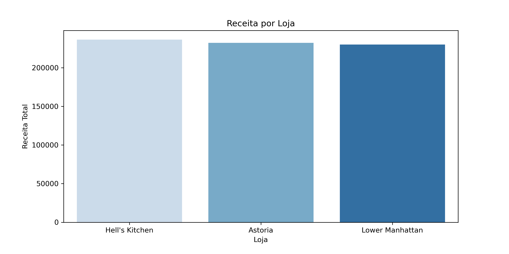
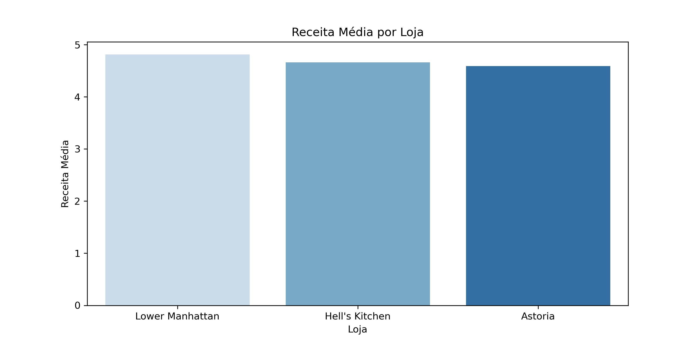
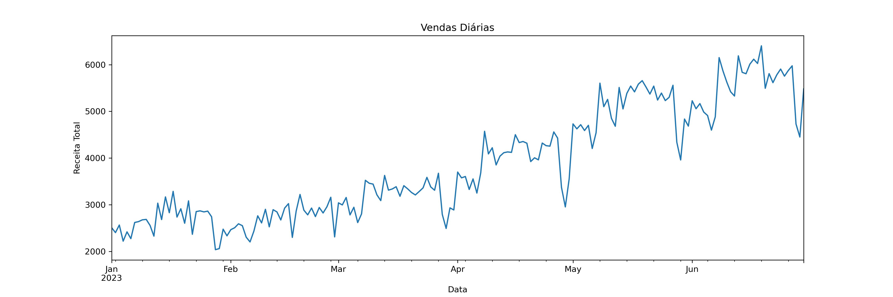
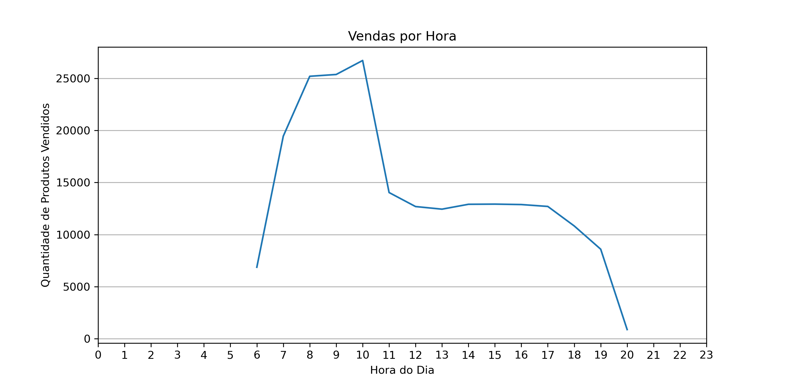

# Análise Exploratória das Vendas de uma Cafeteria

Projeto em andamento.

## Objetivo do projeto
Este projeto tem como objetivo fazer uma análise exploratória dos dados das vendas de uma cafeteria. Os dados foram obtidos da plataforma Kaggle.

## Premissas do negócio
O banco de dados possui 149.116 transações, sendo 1,44 produtos vendidos em média e no máximo 8 produtos. O maior preço único é de $45 e preço mínimo é $0,80.
Não há valores nulos nos dados. Desta forma, não foi necessário fazer o tratamento dos dados.

## Resultados

## Conclusão
