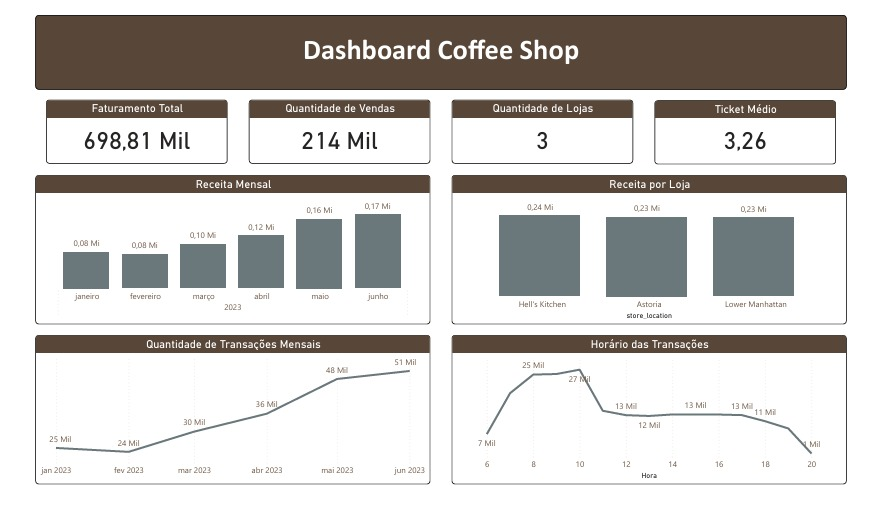
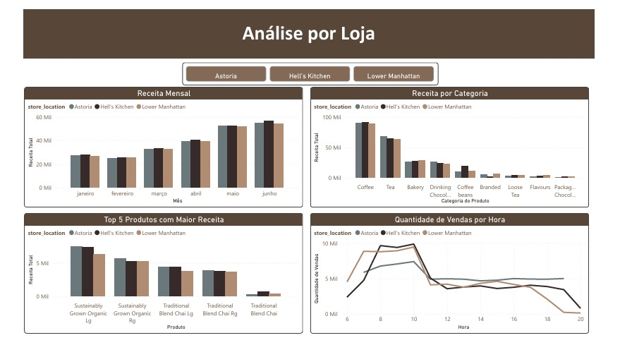
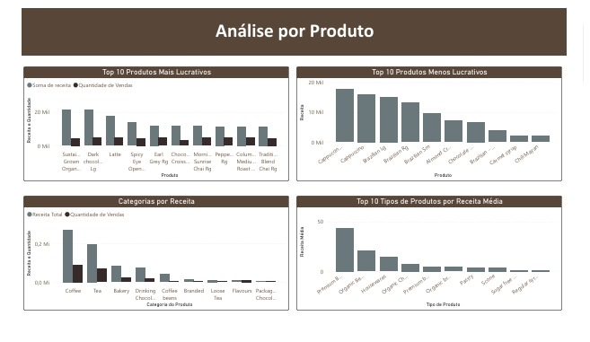

# Análise Exploratória das Vendas de uma Cafeteria

## Objetivo do projeto
Este projeto tem como objetivo analisar o desempenho de vendas de uma cafeteria com três unidades distintas, utilizando dados transacionais para gerar insights estratégicos. Por meio da criação de dashboards interativos no Power BI, buscamos compreender o comportamento dos consumidores ao longo do tempo, identificar os produtos mais lucrativos, os horários de maior movimento, e comparar o desempenho entre as lojas. A análise visa gerando insights com os dados disponíveis e apoiar a tomada de decisões comerciais.

## Premissas do negócio
O banco de dados possui 149.116 transações de três lojas (Hell's Kitchen, Astoria e Lower Manhattan). 
A média de produtos por transação é de 1,44 e no máximo 8 produtos. 
O maior preço único é de $45 do café civete e preço mínimo é $0,80 de quatro produtos (calda de caramelo, calda de chocolate, calda de avelã e calda sem açúcar sabor baunilha.
O período da análise é de janeiro a junho de 2023.
Não há valores nulos nos dados. Desta forma, não foi necessário fazer o tratamento dos dados.

## Resultados
A análise exploratória da cafeteria foi realizada no Microsofr Power BI (versão gratuita), todas as análises foram desenvolvidas localmente, o arquivo está anexado [aqui](Coffee_shop_sale.pbix) para baixar.

Separei os dados em três grupos: uma análise geral, outra voltada para as lojas e, por fim, uma análise por produto.

Na visão geral, observamos que a cafeteria teve um faturamento de US$ 698,81 mil, totalizando 214 mil vendas e um ticket médio de US$ 3,26 nos seis primeiros meses de 2023. Tanto a receita quanto as vendas aumentaram ao longo do período analisado, passando de US$ 80 mil em janeiro para US$ 170 mil em junho.

As três lojas apresentaram receitas superiores a US$ 230 mil, com destaque para a unidade de Hell's Kitchen, que obteve US$ 240 mil em receita. As médias de transações por hora variaram entre 1,41 e 1,49, sendo o horário de abertura, às 6h, o de maior movimento, e o das 19h, o de menor fluxo.

Ao analisar as lojas, observamos que todas apresentaram aumento de receita no período analisado. No entanto, destaca-se que a unidade Hell's Kitchen teve receita superior em todos os meses, em comparação com as outras duas lojas.

As categorias de produto que mais contribuem para a receita das lojas são: café, chá, padaria e bebidas com chocolate. Porém, o item grão de café, especificamente na unidade Hell's Kitchen, apresenta uma receita superior em relação às unidades de Astoria e Lower Manhattan.

O produto líder nas três lojas é o Sustainably Grown Organic, tanto nos tamanhos grande quanto médio. Em seguida, os blends de chai tradicional, também nos tamanhos grande e médio, aparecem como os mais vendidos, indicando uma preferência dos clientes por bebidas diferenciadas e saudáveis.

Em relação ao horário de funcionamento das unidades, a loja de Astoria opera das 7h às 19h, enquanto as unidades de Hell's Kitchen e Lower Manhattan funcionam das 6h às 20h, totalizando duas horas a mais de atendimento.

Outro ponto que merece destaque é a média de transações por hora da unidade Lower Manhattan, que é superior em quase todos os horários, exceto às 13h e às 18h, momentos em que a unidade de Hell's Kitchen apresenta maior movimentação.

Já a unidade de Astoria registra médias de transações por hora entre 1,36 e 1,44. As maiores médias de transações por hora nas unidades Hell's Kitchen e Lower Manhattan são, respectivamente, 1,48 e 1,55.

Na análise anterior, observou-se que os produtos com maior receita foram o Sustainably Grown Organic e os blends de chai. No entanto, ao analisar a quantidade vendida, esses dois produtos não aparecem entre os cinco mais vendidos.

Em primeiro lugar, temos o Earl Grey Rg, com 4.708 unidades vendidas, seguido por Dark Chocolate Lg (4.668 unidades) e Morning Sunrise Chai Rg (4.643 unidades). O Traditional Blend Chai Rg ocupa a sétima posição, com 4.512 unidades, enquanto o Sustainably Grown Organic Lg está em oitavo lugar, com 4.453 unidades vendidas.

Entre os produtos comercializados pelas cafeterias, alguns registraram receitas inferiores a US$ 10 mil, sendo eles:

- Chili Mayan: US$ 1.972,84

- Caramel Syrup: US$ 2.060,80

- Brazilian Organic: US$ 3.852,00

- Chocolate Chip Biscotti: US$ 6.748,96

- Almond Croissant: US$ 7.168,13

As categorias com mais de 1.500 unidades vendidas ao longo do período foram: café, chá, padaria, bebidas com chocolate e "Flavours". Essa última categoria só ultrapassou a marca de 1.500 unidades a partir de abril.

Todas as categorias apresentaram crescimento nas vendas, com destaque para o café, que teve um aumento expressivo: passou de 10 mil unidades vendidas em janeiro para 21 mil unidades em junho, o que representa mais que o dobro em apenas seis meses.

## Conclusão
